#### 题目描述
DBLP数据集 包括超过100万篇发表在计算机科学会议和杂志上的论文项。在这些项中，很多作者都有合著关系。<br>
(a)提出一种方法，挖掘密切相关的（即，经常一起合写文章）合著者关系。<br>
(b)根据挖掘结果和本章讨论的模式评估度量，讨论哪种度量可能比其他度量更令人信服地揭示紧密合作模式。<br>
(c)基于以上研究，开发一种方法，它能粗略地预测导师和学生关系，以及这种指导的近似周期。<br>

#### 测试数据
从官网下载DBLP数据集<br>
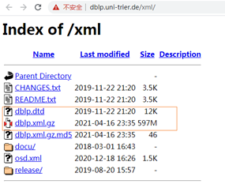
<br>解压缩后得:<br>
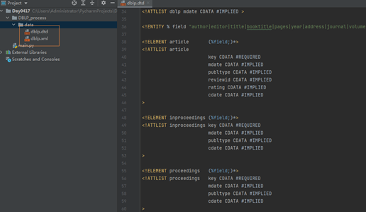<br>
‘’‘ 文件太大无法上传 ’‘’
#### 结题思路
从DBLP数据库中找到经常一起写作的合作者任务分解：<br>
从DBLP数据集中提取作者信息<br>
建立索引作者ID并对文件编码<br>
分析数据的规模<br>
构建FP-Tree并从FP-Tree得到频繁项集<br>
频繁项集挖掘结果分析<br>
##### 解析文件
所有的作者信息分布在以下这些属性中：<br>
‘article’,‘inproceedings’,‘proceedings’,‘book’,‘incollection’,‘phdthesis’,‘mastersthesis’,‘www’<br>
使用python自带的xml分析器解析，分析器在进入上面那些属性中的某一个时，标记flag=1，然后将author属性的内容输出到文件，退出时再标记flag = 0<br>

解析源代码为：<br>

```python
import codecs
from xml.sax import handler, make_parser
from time import strftime, localtime

paper_tag = ('article', 'inproceedings', 'proceedings', 'book',
             'incollection', 'phdthesis', 'mastersthesis', 'www')

# 打印当前时间
def printTime():
    print(strftime("%Y-%m-%d %H:%M:%S", localtime()))
    return

class mHandler(handler.ContentHandler):
    def __init__(self, result):
        self.result = result
        self.flag = 0

    def startDocument(self):
        print('Document Start')
        printTime()

    def endDocument(self):
        print('Document End')
        printTime()

    def startElement(self, name, attrs):
        if name == 'author':
            self.flag = 1

    def endElement(self, name):
        if name == 'author':
            self.result.write(',')
            self.flag = 0
        if (name in paper_tag):
            self.result.write('\r\n')

    def characters(self, chrs):  # [8]
        if self.flag:
            self.result.write(chrs)

def parserDblpXml(source, result):
    handler = mHandler(result)
    parser = make_parser()
    parser.setContentHandler(handler)

    parser.parse(source)

if __name__ == '__main__':
    source = codecs.open('data/dblp.xml', 'r', 'utf-8')
    result = codecs.open('data/authors.txt', 'w', 'utf-8')
    parserDblpXml(source, result)
    result.close()
    source.close()
```
结果保存到authors.txt文件：<br>
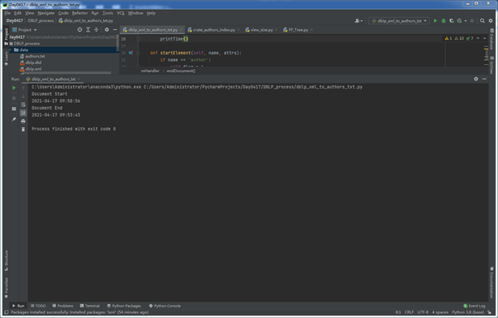
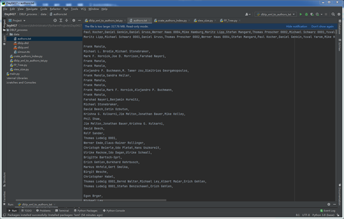
#####  建立索引作者ID
读取得到的authors.txt文件，将其中不同的人名按照人名出现的次序编码,
存储到文件authors_index.txt中，同时将编码后的合作者列表写入authors_encoded.txt文件。
源代码为：<br>
```python
import codecs
from time import strftime, localtime
source = codecs.open('data/authors.txt','r','utf-8')
result = codecs.open('data/authors_encoded.txt','w','utf-8')
index = codecs.open('data/authors_index.txt','w','utf-8')
index_dic = {}
name_id = 0

# 打印当前时间
def printTime():
    print(strftime("%Y-%m-%d %H:%M:%S", localtime()))
    return

print("Authors' index create Start")
printTime()

for line in source:
    name_list = line.split(',')
    for name in name_list:
        if not (name == '\r\n'):
            if name in index_dic:
                index_dic[name][1] +=1
            else:
                index_dic[name] = [name_id,1]
                index.write(name + u'\r\n')
                name_id += 1
            result.write(str(index_dic[name][0]) + u',')
    result.write('\r\n')

source.close()
result.close()
index.close()
print(" Authors' index create End")
printTime()
```
运行结果：<br>
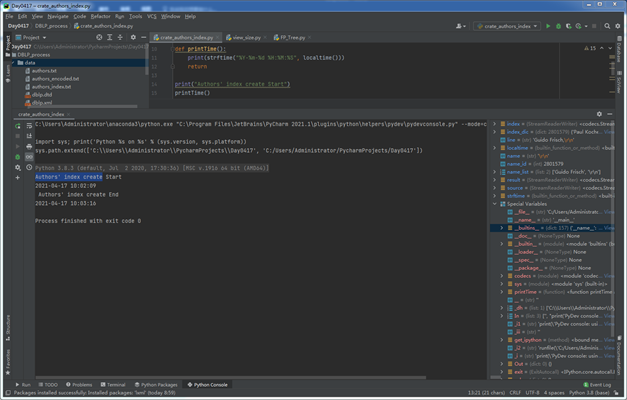<br>
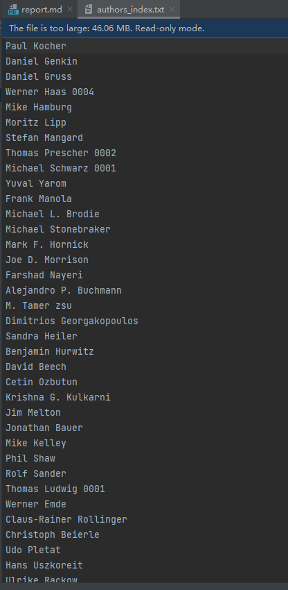
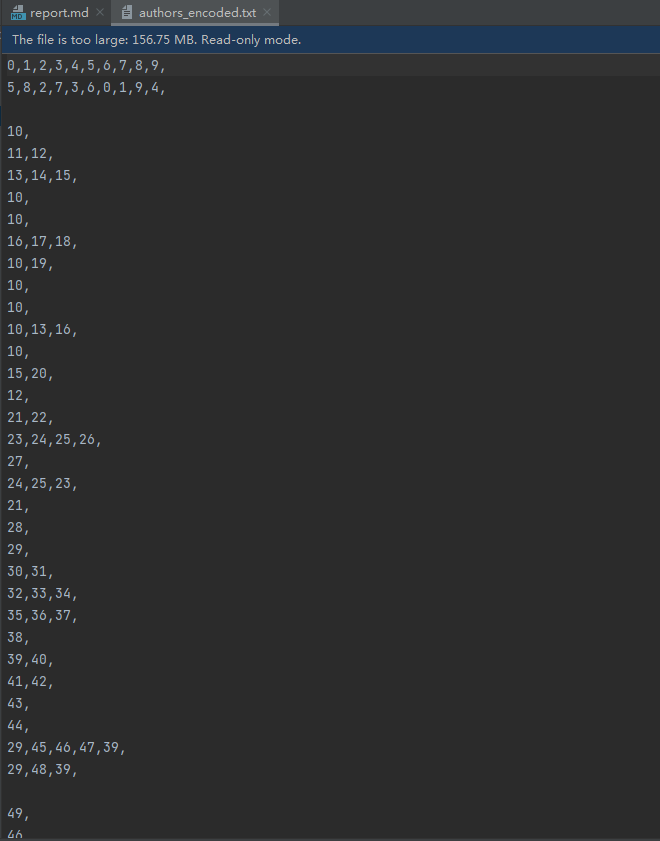
#####  分析数据的规模
查看在DBLP数据集中作者发表文章的数量。即统计只发表过1次文章的人数有多少，
发表过2篇文章的人数有多少…发表过n篇文章的有多少人,分析可知，当支持度为40的作者数量接近1000，
随后支持度每增加20，对应的作者数量减半，为了降低计算量，第一次实验时支持度阈值不宜选得太小，
同时为了避免结果数量太少，初次实验时阈值可选在40~60之间,这里不妨选40。<br>
源代码为：<br>
```python
# -*- coding: utf-8 -*-
from matplotlib.font_manager import FontProperties
import codecs
import matplotlib.pyplot as plt
import numpy as np

font = FontProperties(fname=r"data/simsun.ttc", size=14)
data = codecs.open('data/authors_encoded.txt','r','utf-8')
word_counts = {}
maxCounts = 0
for line in data:
    line = line.split(',')
    for word in line[0:-1]:
        word_counts[word] = word_counts.get(word,0) + 1
        if word_counts[word] > maxCounts:
            maxCounts = word_counts[word]
            maxKey = word

xMax = maxCounts
data.close()
bins = {}
for k,v in word_counts.items():
    bins[v] = bins.get(v,0) + 1

y = []
for i in range(40, 200):
    y.append(bins.get(i,0))
plt.plot(y,'-');
plt.grid()
plt.yticks(range(0,1000,100))
plt.xticks(range(0,160,20),range(40,200,20))
plt.xlabel(u'支持度',fontproperties=font)
plt.ylabel(u'对应支持度下的作者个数',fontproperties=font)
plt.title(u'作者数量与支持度之间的对应关系',fontproperties=font)
plt.show()
```
运行结果：<br>
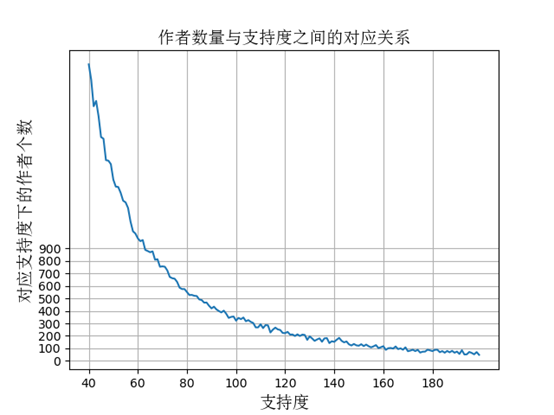
##### 构建FP-Tree得到频繁项集
FP-Tree算法其核心思想分为2步，首先扫描数据库得到FP-Tree,然后再从树上递归生成条件模式树并上溯找到频繁项集。<br>
源代码为：<br>
```python
from time import strftime, localtime

# 打印当前时间
def printTime():
    print(strftime("%Y-%m-%d %H:%M:%S", localtime()))
    return

class treeNode:
    def __init__(self, nameValue, numOccur, parentNode):
        self.name = nameValue
        self.count = numOccur
        self.nodeLink = None
        self.parent = parentNode  # needs to be updated
        self.children = {}

    def inc(self, numOccur):
        self.count += numOccur

    def disp(self, ind=1):
        print('  ' * ind, self.name, ' ', self.count)
        for child in self.children.values():
            child.disp(ind + 1)


def createTree(dataSet, minSup=1):  # create FP-tree from dataset but don't mine
    freqDic = {}
    # go over dataSet twice
    for trans in dataSet:  # first pass counts frequency of occurance
        for item in trans:
            freqDic[item] = freqDic.get(item, 0) + dataSet[trans]

    headerTable = {k: v for (k, v) in freqDic.items() if v >= minSup}

    # print 'freqItemSet: ',freqItemSet
    if len(headerTable) == 0: return None, None  # if no items meet min support -->get out
    for k in headerTable:
        headerTable[k] = [headerTable[k], None]  # reformat headerTable to use Node link
    # print 'headerTable: ',headerTable
    retTree = treeNode('Null Set', 1, None)  # create tree
    for tranSet, count in dataSet.items():  # go through dataset 2nd time
        localD = {}
        for item in tranSet:  # put transaction items in order
            if headerTable.get(item, 0):
                localD[item] = headerTable[item][0]
        if len(localD) > 0:
            orderedItems = [v[0] for v in sorted(localD.items(), key=lambda p: p[1], reverse=True)]
            updateTree(orderedItems, retTree, headerTable, count)  # populate tree with ordered freq itemset
    return retTree, headerTable  # return tree and header table


def updateTree(items, inTree, headerTable, count):
    if items[0] in inTree.children:  # check if orderedItems[0] in retTree.children
        inTree.children[items[0]].inc(count)  # incrament count
    else:  # add items[0] to inTree.children
        inTree.children[items[0]] = treeNode(items[0], count, inTree)
        if headerTable[items[0]][1] == None:  # update header table
            headerTable[items[0]][1] = inTree.children[items[0]]
        else:
            updateHeader(headerTable[items[0]][1], inTree.children[items[0]])
    if len(items) > 1:  # call updateTree() with remaining ordered items
        updateTree(items[1::], inTree.children[items[0]], headerTable, count)


def updateHeader(nodeToTest, targetNode):  # this version does not use recursion
    while (nodeToTest.nodeLink != None):  # Do not use recursion to traverse a linked list!
        nodeToTest = nodeToTest.nodeLink
    nodeToTest.nodeLink = targetNode


def ascendTree(leafNode, prefixPath):  # ascends from leaf node to root
    if leafNode.parent != None:
        prefixPath.append(leafNode.name)
        ascendTree(leafNode.parent, prefixPath)


def findPrefixPath(basePat, treeNode):  # treeNode comes from header table
    condPats = {}
    while treeNode != None:
        prefixPath = []
        ascendTree(treeNode, prefixPath)
        if len(prefixPath) > 1:
            condPats[frozenset(prefixPath[1:])] = treeNode.count
        treeNode = treeNode.nodeLink
    return condPats


def mineTree(inTree, headerTable, minSup, preFix, freqItemList):
    bigL = [v[0] for v in sorted(headerTable.items(), key=lambda p: p[1][0])]  # (sort header table)
    for basePat in bigL:  # start from bottom of header table
        newFreqSet = preFix.copy()
        newFreqSet.add(basePat)
        # print 'finalFrequent Item: ',newFreqSet    #append to set
        if len(newFreqSet) > 1:
            freqItemList[frozenset(newFreqSet)] = headerTable[basePat][0]
        condPattBases = findPrefixPath(basePat, headerTable[basePat][1])
        # print 'condPattBases :',basePat, condPattBases
        # 2. construct cond FP-tree from cond. pattern base

        myCondTree, myHead = createTree(condPattBases, minSup)
        # print 'head from conditional tree: ', myHead
        if myHead != None:  # 3. mine cond. FP-tree
            # print 'conditional tree for: ',newFreqSet
            # myCondTree.disp(1)
            mineTree(myCondTree, myHead, minSup, newFreqSet, freqItemList)


def loadSimpDat(inFile):
    dataSet = {}
    for line in inFile:
        line = line.strip().split(',')
        dataLine = [word for word in line if word.isdigit()]
        dataSet[frozenset(dataLine)] = dataSet.get(frozenset(dataLine), 0) + 1

    return dataSet


if __name__ == "__main__":
    minSup = 100
    print("Start")
    printTime()
    print("Reading Source File ... Wait...")
    with open('data/authors_encoded.txt', 'r') as f:
        dataSet = loadSimpDat(f)

    printTime()
    print("Constructing FP-tree ... Wait...")
    myFPtree, myHeaderTab = createTree(dataSet, minSup)

    printTime()
    print("Mining frequent items ... Wait...")
    myFreqList = {}
    mineTree(myFPtree, myHeaderTab, minSup, set([]), myFreqList)
    print("Totally %d frequent itemsets found ! " % len(myFreqList))
    printTime()
    print("Constructing authors_index... Wait...")

    maxCoauthors = 0
    for freqAuthors in myFreqList.keys():
        if len(freqAuthors) > maxCoauthors:
            maxCoauthors = len(freqAuthors)
    print("the max num of coauthors is %d " % (maxCoauthors))

    with open('data/authors_index.txt', 'r') as authorsIndex:
        i = 0
        authorsDic = {}
        for name in authorsIndex:
            name = name.strip()
            authorsDic[i] = name
            i = i + 1

    printTime()
    print("Writing result into result.txt... Wait...")

    with open('result/result1.txt', 'w') as result2:
        with open('result/result0.txt', 'w') as result:
            result.write("%25s\t%25s\t%15s\t%10s\t%6s\t%6s\t%6s\t%6s\t%6s\t%6s\t%6s\t%6s\n" \
                         % ('authorA', 'authorB', 'authorC', 'Sup(A,B,C)', 'Sup(A)', 'Sup(B)', 'Sup(C)', \
                            'Con(A)', 'Con(B)', 'Con(C)', 'MinCon', 'MaxCon'))
            result2.write("%25s\t%25s\t%15s\t%10s\t%6s\t%6s\t%6s\t%6s\t%6s\t%6s\t%6s\t%6s\n" \
                          % ('authorA', 'authorB', 'authorC', 'Sup(A,B,C)', 'Sup(A)', 'Sup(B)', 'Sup(C)', \
                             'Con(A)', 'Con(B)', 'Con(C)', 'MinCon', 'MaxCon'))
            resultList = sorted(myFreqList.items(), key=lambda p: p[1], reverse=True)
            for itemSet, support in resultList:
                itemList = list(itemSet)
                A = itemList[0]
                authorA = authorsDic.get(int(A), '0')
                B = itemList[1]
                authorB = authorsDic.get(int(B), '0')
                SupAB_C = int(support)
                SupA = int(myHeaderTab.get(A, [0])[0])
                SupB = int(myHeaderTab.get(B, [0])[0])
                ConA = float(SupAB_C) / float(SupA)
                ConB = float(SupAB_C) / float(SupB)
                (C, authorC, SupC, ConC) = ('', '', 0.0, 0.0)

                if len(itemList) == 3:
                    C = itemList[2]
                    authorC = authorsDic.get(int(C), '0')
                    SupC = int(myHeaderTab.get(C, [0])[0])
                    ConC = float(SupAB_C) / float(SupC)
                    MinCon = min([ConA, ConB, ConC])
                    MaxCon = max([ConA, ConB, ConC])
                elif len(itemList) == 2:
                    MinCon = min([ConA, ConB])
                    MaxCon = max([ConA, ConB])

                if MinCon < 0.4 or MaxCon < 0.5 or (MinCon + MaxCon) / 2 < 0.5:
                    continue
                result.write("%25s\t%25s\t%15s\t%10.0f\t%6.0f\t%6.0f\t%6.0f\t%6.4f\t%6.4f\t%6.4f\t%6.4f\t%6.4f\n" % (authorA, authorB, authorC, SupAB_C, SupA, SupB, SupC, ConA, ConB, ConC, MinCon, MaxCon))
                result2.write("%25s\t%25s\t%15s\t%10.0f\t%6.0f\t%6.0f\t%6.0f\t\%6.4f\t%6.4f\t%6.4f\t%6.4f\t%6.4f\n" % (A, B, C, SupAB_C, SupA, SupB, SupC, ConA, ConB, ConC, MinCon, MaxCon))

    result.close()
    result2.close()
    authorsIndex.close()
    f.close()
    printTime()
    print("Finished !")
```
运行结果：<br>
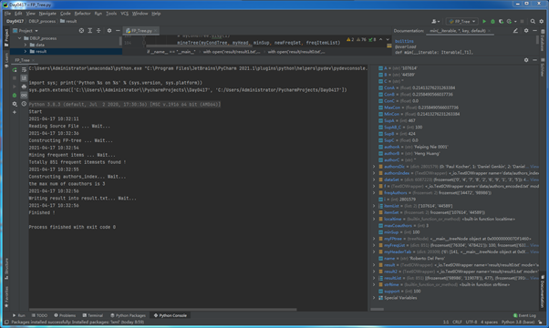
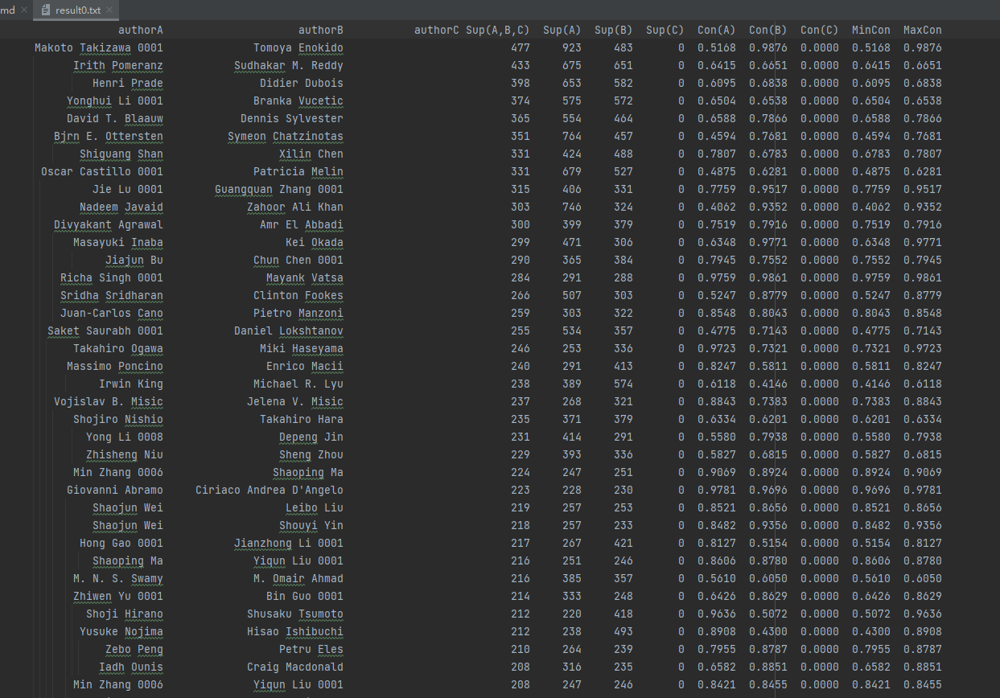
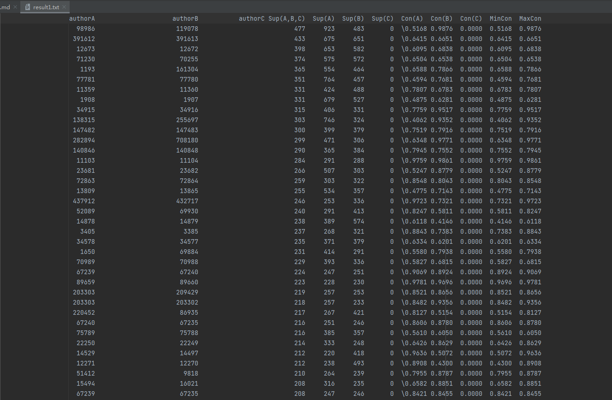
**输出结果说明**<br>
统计满足支持度条件的合作者个数可以发现，经常一起合作的作者数目最多为3，故在输出文件中输出authorA，authorB，authorC（当合作者数目为2时，authorC为空，其对应支持度和置信度为0），Sup（A,B,C）为A,B,C共同合作的次数，Sup（A）Sup（B）Sup（C）分别为A,B,C各自的写作次数，Con（A）、Con（B）、Con（C）分别表示A,B,C的置信度（即合作次数除以写作总次数）MinCon和MaxCon分别统计Con（A）、Con（B）、Con（C）的最小值和最大值（注意，当authorC为空时，其对应的置信度不加入最大最小值的统计）<br>
**输出结果分析**<br>
初步分析可以发现以下特性：<br>
1.在满足支持度条件的合作者中，大多数是两个人，但是也有少数3个人一起经常合作的情况；<br>
2.由于在这里我们关注的是作者之间的合作程度，故可以不关注提升度对于结果的影响；<br>
3.合作者之间的关系是双向性的，也就是说，A与B的合作程度与B与A合作的程度是一致的，因此可以直接考虑置信度；<br>
4.在按支持度排序后，某些作者的置信度较低，需要引入置信度阈值，为了避免置信度不平衡的情况（比如A经常和B合作，但该合作次数占B写作次数很少一部分），
需要加入阈值条件MinCon>=阈值,同时置信度中的较大值应该满足MaxCon>=1/2，另外加入平衡条件后过滤结果。<br>
**(b)根据挖掘结果和本章讨论的模式评估度量，讨论哪种度量可能比其他度量更令人信服地揭示紧密合作模式。**<br>
关于作者A(Noboru Niki)和作者B(Kenji Eguchi)的2×2的相依表(显示期望值)

|                | Kenji Eguchi |  ^(Kenji Eguchi) | sum |
| :------------- | :----------- | ---------------: | -----: |
| Noboru Niki    | 100(0.119)   |    6(105.9)      | 106 |
| ^(Noboru Niki) | 66(165.9)    |  14653(147,481)  | 147647 |
| sum            | 166          |      147587      | 147753 |

1.使用提升度的相关分析<br>
P({A})=106/147753<br>
P({B})=166/147753<br>
P({A,B})=100/147753<br>
提升度为P({A,B})/(P({A})*P({B}))=(100/147753)/(106/147753)*(166/147753)=839.67<br>
2．使用χ2进行相关分析<br>
(100-0.119)^2➗0.119 + (6-105.9)^2➗105.9 + (66-165.9)^2➗165.9 + (14653-147481)^2➗147481 =
83,833.73 + 94.23 + 60.15 + 119,630.85 =203,619<br>
3.全置信度<br>
P({A|B})=100/106=0.943<br>
P({B|A})=100/166=0.602<br>
all_conf(A,B)=min{P({A|B}),P({B|A})}=0.602<br>
4.最大置信度<br>
max{P({A|B}),P({B|A})}=0.943<br>
5. Kulczynski置信度<br>
Kulc(A,B)= 1/2*(P(A|B)+P(B|A))=0.773<br>
6.余弦置信度<br>
Cosine(A,B)= sqrt(P(A|B)P(B|A))= 0.754<br>
比较6种模式评估度量:<br>
上述6种模式评估中，提升度和χ2的计算受零事务的影响很大，在上面的例子中，^AB表示零事务的个数。一般, 
   零事务的个数可能大大超过个体购买的个数，因为，A和B发表过的论文相对于整个数据库中的论文总数，
   是很小的一部分。其他四个度量很好地消除了^AB的影响。由于上述例子中P(A|B）和P(B|A)差别较大，
   导致四种评估度量(全置信度，最大置信度，Kulczynski，余弦)结果也差别较大，<br>
**(c)基于以上研究，开发一种方法，它能粗略地预估导师和学生的关系，以及这种指导的周期**<br>
1.根据经验，我们知道，学生发表的论文上往往会署导师的名字，而导师的论文上却不一定有学生的署名,或者说导师发表过的论文要远比学生多，
而且老师往往同时指导多个学生，设置两个参数15和5，作者A和B、C、D、E满足频繁项集的要求,并且A发表过的论文不小于15篇，B、C、D、E发表过的论文不超过5篇，
则我们可以认定A为导师，B、C、D、E为A指导的学生。<br>
2.若要求得指导的近似周期，我们需要在求频繁项集时，将发表的日期作为属性假如到事务中，如果我们已确定A为导师，B为学生，
并且他们的合著次数满足频繁项集的支持度，我们需要计算A和B合著论文中的最近日期和最早日期，最近日期-最早日期+ 1~2年=近似的指导周期。<br>
[参考博客](https://github.com/findmyway/DBLP-Coauthor)